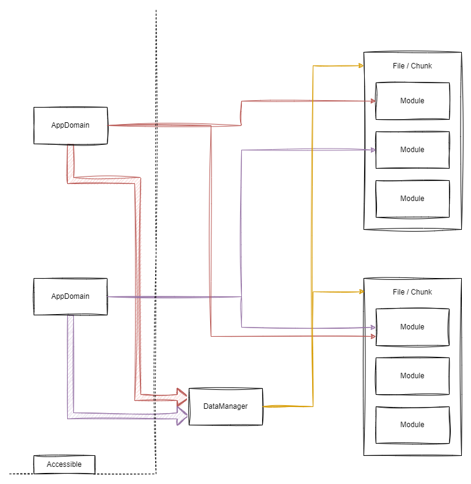

# TSB

A simple, fast bundler system for TypeScript

## Installation

```shell
npm install -g @bytelab.studio/tsb
```

## Using the tool

To use the `tsb` tool for your project, follow the steps below.

### Step 1: Initialize a Project

First, let `tsb` handle the setup

```shell
tsb init
```

After running the command, your file structure should look like this:

```text
.
├── node_modules
│       └── @bytelab.studio
│               └── tsb-runtime
├── out
├── package-lock.json
├── package.json
├── src
├── tsb.js
└── tsconfig.json
```

### Step 2: Configure Your Project

A `tsb.js` file is generated automatically and looks something like this:

> `tsb.js` is loaded in a sandbox context, so most Node.js features are disabled, including
> `require` modules, except for `tsb`.

```javascript
const {builder} = require("tsb");

builder
    .module("my-module")
    .addFolders("./src")
    .output("./out")
    .platform("nodejs")
```

- The `module` function sets the name of your project, similar to the `name` property in `package.json`.
- The `addFolders` function adds a folder recursively to the source files.
- The `output` function sets the output directory for your bundled files.
- The `platform` function sets the output platform of the project, e.g., `nodejs` or `browser`

All flags except `--script` and `-h | --help` can be set through the config file.

```text
Usage: tsb build <files> [options]
  -m=name, --module=name        The module name
  <>                            The files to be compiled
  -p=platform, --platform=platform
                             The target platform
  -e=file, --entry=file         The entry file
  -o=path, --output=path        The output path
  --chunk-size=bytes            Sets the minimal chunk size in bytes
  --script                      Use tsb.js definition in the CWD
  -h, --help                    Prints this help string
  --plugin-minify               Minifies the JavaScript output
```

| Flag           | Function                 |
|----------------|--------------------------|
| &lt;files>     | `addFiles`, `addFolders` |
| -m, --module   | `module`                 |
| -p, --platform | `platform`               |
| -e, --entry    | `entry`                  |
| --chunk-size   | `chunkSize`              |
| --plugin-*     | `plugins`                |

### Step 3: Write Program Content

Now, write the actual program.

```typescript
// src/foo.ts

export function foo() {
    console.log("Foo");
}
```

```typescript
// src/entry.ts

import {foo} from "./foo"

foo();
```

### Step 4: Build the Project

To build the project, run the following command in your project directory:

```shell
tsb build --script
```

Files are generated in the output folder:

```text
out
 ├── chunks
 │       └── <chunk>.js
 └── <module>.js
```

### Step 5: Run the Project

To run the project, use the following command:

```shell
node ./out/<module>.js
```

Now your project is set up, configured, and ready to run using `tsb`.

## Technical

### Bundle structure



Each file/chunk is syntactically standalone and can be copied across projects. These chunks contain one or more modules.
Before a module can be loaded into an AppDomain, these chunks must be loaded by the DataManager. The loading process
depends on the bundling platform specified in the config or CLI flag.

During bundling, the DataManager gets an embedded file map, which means it can only load chunks and modules listed in
this file map. The user/programmer interacts only with the AppDomain. An AppDomain represents the context of modules.
When a module is loaded into two different AppDomains, it is executed twice because it is cached only in the first
AppDomain on the first load. Every program has at least one AppDomain, usually the primaryDomain.

### Module hashing

Each module is represented by a hash generated using the FNV-1a hashing algorithm based on the resource path of the
file:

```text
res://<module>/path/to/file.ts
```

### NodeJS Modules

Currently, there is no way to include NodeJS modules directly in the bundled files. However, loading of NodeJS modules
is supported on the NodeJS platform, and context switching with AppDomains across NodeJS modules is also supported.

## Roadmap

Nothing in this roadmap is a promise. Everything in this roadmap is changeable.

- [x] Multi-platform support
- [ ] Enable loading files via resource path
- [ ] Enable loading chunks that are not directly integrated
- [ ] Some sort of library system using NPM to install bundled libraries
- [ ] Macro-Plugin