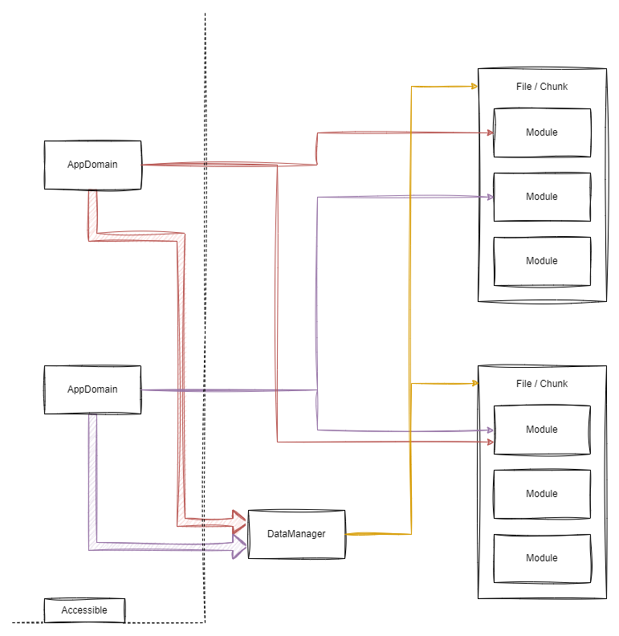

# Bundle Structure



## AppDomain

An `AppDomain` represents the loading context of your application and is the sole access point for interacting with API
features within your application. A module loaded into an `AppDomain` is cached exclusively within that `AppDomain`,
meaning
modules can be executed or initialized multiple times if loaded into different `AppDomains`. Every application has at
least one `AppDomain`, typically referred to as the `primaryDomain`.

## DataManager

The `DataManager` is responsible for loading files/chunks and file maps. It also provides helper functions for resolving
module hashes and module resource paths. The loading process may vary depending on the bundling platform.

## File / Chunks

Each file contains one or more modules. Chunks are uniquely identified by a chunk FNV-1a hash, which is generated based
on the full output path:

```text
C:\..\my-project\out\chunks\chunk<index>.js
```

## Module

Each source file is compiled into a module. A module has a unique FNV-1a hash generated from the full source file path.
Additionally, a module has a resource path that represents the shortest possible path to the file.

### Example 1: Compiling a Single Source File

When compiling a single source file, the resource path is as follows:

```text
res://<module>/myFile.ts
```

### Example 2: Compiling Multiple Source Files in Different Folders

When compiling multiple source files located in different folders:

```text
foo/foo.ts
bar/bar.ts
```

The resource paths will be:

```text
res://<module>/foo/foo.ts
res://<module>/bar/bar.ts
```

### Example 3: Compiling Multiple Source Files in the Same Folder

When compiling multiple source files within the same folder:

```text
foo/foo.ts
foo/bar.ts
```

The resource paths will be:

```text
res://<module>/foo.ts
res://<module>/bar.ts
```